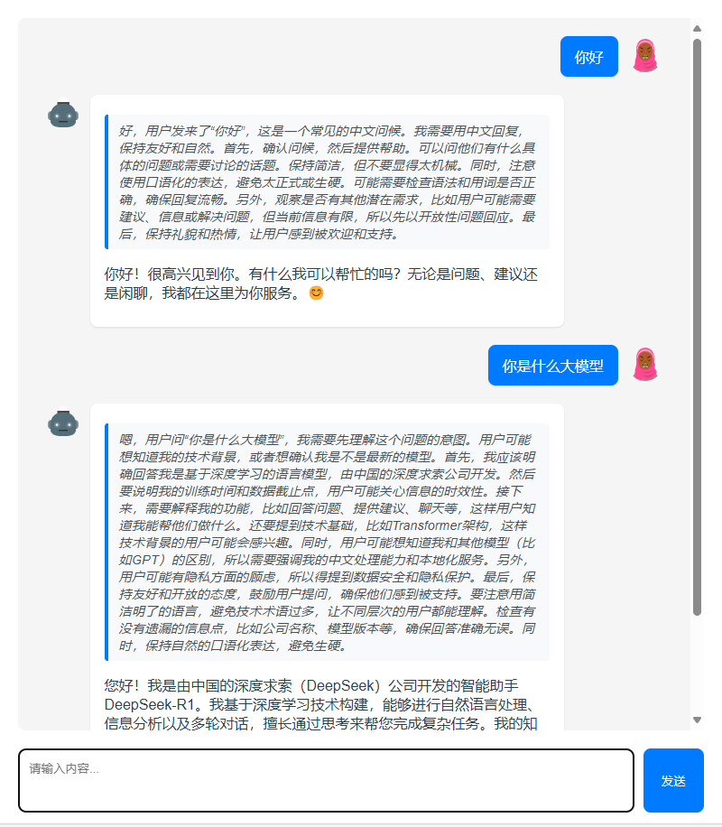

# Vue Chat 聊天应用

一个基于Vue.js开发的简洁聊天应用界面，提供基础的消息交互功能。

## 功能特点

- 简洁现代的用户界面设计
- 消息实时显示
- 支持文本消息发送
- 响应式布局，适配不同屏幕尺寸
- 支持 deepseek api、ollama api

## 技术栈

- Vue.js
- Vue CLI
- JavaScript (ES6+)
- CSS3

## 项目设置

### 安装依赖
```
yarn install
```

### 开发环境运行
```
yarn serve
```

### 生产环境构建
```
yarn build
```

### 代码检查和修复
```
yarn lint
```

## 项目预览



